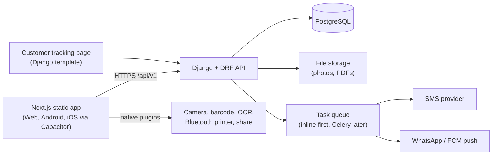

# Repair Shop Manager: Product & Technical Blueprint

*Version 1.0 · 1 October 2026 · Document 1 of 3 (next: core database schema, then Phase 1 weekly roadmap)*

> **Read this first.** Prices, free-tier limits, store policies and legal rules change often. Everything marked *(verify)* should be re-checked before you commit to it. Cost figures are rough estimates, not quotes. Nothing here is legal or tax advice.

---

## 1. What you are building

A multi-tenant repair-shop management product for mobile/laptop/appliance repair shops in India, delivered as **Android + iOS + Web** from one codebase. It is being built for a client, starting with one shop and designed to scale to many. It should beat the existing market app (Repairing Shop Manager by Click4Kart) on **reliability, UX, offline support, staff controls and iOS/web parity**, not on price.

### Decisions locked so far

| Area | Decision |
|---|---|
| Users | One shop first; many shops (SaaS) later |
| Platforms | Android, iOS, Web, one Next.js codebase wrapped by Capacitor |
| Team / timeline | Solo developer, no deadline, phased delivery |
| Revenue | Subscription: free tier + monthly/annual plans + add-ons (branches, staff seats, messaging credits); optional high-priced "lifetime" core plan |
| Login | Phone number + SMS OTP; optional staff PIN on shared devices |
| Languages | English, Hindi, other Indian languages, Hinglish (`hi-Latn`) |
| Printing | Bluetooth thermal (58/80 mm) **and** A4/A5 PDF |
| GST | Optional per shop (toggle) |
| Job visibility | Default: all staff see all jobs; owner can restrict engineers to assigned jobs; role permissions + audit log |
| Customers | No customer app. Tracking link + QR code on the job sheet |
| Payments | Manual recording + UPI QR on bills first; payment-gateway links later |
| Locations | Organisation → branches. Hidden until the owner adds a second branch |
| IMEI entry | Manual typing + camera barcode scan + OCR of the sticker |
| Offline | Online-first. Offline for core job/billing flows is a later bonus phase |
| Marketplace / community | Later phase (design hooks now) |
| Hosting | Free during development/pilot; buy a VPS when scaling |

---

## 2. Feature scope by phase

Features come from the market app's screenshots, its Play Store listing and its website, plus the improvements in section 1.

### Phase 0: Foundations
- Monorepo, Docker Compose dev environment, CI, linting, tests
- Organisation → Shop → Staff membership model; roles and permissions
- Phone + SMS OTP login, JWT sessions, device list, logout-all
- i18n scaffolding (English/Hindi/Hinglish), Indian number formatting
- Design system, app shell, bottom navigation
- Capacitor shells running on a real Android phone and a real iPhone
- Audit log, soft delete, error monitoring

### Phase 1: Core repair MVP (pilot at your own shop)
- Customers (search by name/phone), devices with IMEI/serial
- **Job sheet:** device, fault, accessories received, lock pattern/PIN, condition notes, photos, estimate, advance, expected date
- Statuses, engineer assignment, notes, history; dashboard counters (today / pending / repaired / delivered)
- **Tracking link + QR** (server-rendered Django page, random token)
- WhatsApp share (`wa.me` links) and optional SMS updates
- **Invoices:** simple bill, with GST toggle (GSTIN, HSN/SAC, CGST/SGST/IGST), invoice series per financial year, credit notes instead of deletes
- **Payments:** cash / UPI / card / bank, advance, part payments, refunds, balance; UPI QR on bill
- **Printing:** A4/A5 PDF (server-side) + thermal receipt (Android first, then iOS BLE)
- IMEI entry: type / barcode scan / OCR, with check-digit validation
- "Check IMEI" shortcut to the official Indian service (prefilled SMS or portal link)
- Trash and restore, export to PDF/Excel, "Lock order after delivery"
- Basic reports, English/Hindi/Hinglish UI

### Phase 2: Stock, sales and money
- Inventory: categories, parts, suppliers/dealers, stock in/out, auto-deduct on repair completion, low-stock alerts
- POS counter, sales, returns, price-drop tracking, close register (day end by payment mode)
- **Khata:** daily/monthly revenue, expense, net profit; profit split by repairs/sales/rough/quick; pending udhaar and customer ledger
- Rough Reg and Quick Bill, Old Buy (purchase records), Demands (item requests)
- Staff management: salary, commission %, performance and repair records
- Monthly fixed expenses, hardware part matcher (compatibility table)
- Profit per technician / brand / repair type (improvement over the market app)

### Phase 3: Scale and monetisation
- Subscription plans, limits and billing (see store-billing note in section 9)
- Branch switcher and consolidated reports
- Offline mode with sync (outbox + conflict policy)
- Bulk SMS, WhatsApp Business API automation (optional)
- Customer feedback/reviews via link, Google-review button
- Personal website generator for each shop (from shop profile + services)
- Site leads (old-phone purchase requests from the shop's website)
- Admin console for you (shops, plans, usage, support)
- Referral "Share & Earn", FAQ/tutorial videos
- Optional payment-gateway links per shop

### Phase 4: Marketplace and community
- Nearby shops and wholesalers, "Trusted" verification, listings, call/visit actions
- Moderation, reporting, seller verification
- Desktop/Windows installer only if customers ask (the web app may be enough)
- Anything still unclear from the market app (for example its "AI App" QR feature, which is not explained in the screenshots)

---

## 3. Architecture

### Non-negotiable design rules (cheap now, painful to retrofit)
1. **Tenant scoping:** every business table has `shop_id`; every query filters by the user's shop memberships; automated tests prove cross-shop leakage is impossible.
2. **UUID primary keys**, `created_at`, `updated_at`, `deleted_at` on every table (this is what makes offline sync possible later).
3. **Money as integer paise**, never floats. Store rates and amounts on the invoice as snapshots.
4. **Invoices are immutable** once issued. Fix mistakes with credit notes.
5. **Audit log** for status changes, edits, deletes, permission changes, exports.
6. **Idempotency keys** on create endpoints (safe retries on bad networks).
7. **Store UTC, display IST.** Financial year runs April to March.
8. **Versioned API** (`/api/v1/`) so old app versions keep working.
9. **All user-facing strings in translation files** from the first screen.
10. **Public data separated from private data**, because the marketplace must never leak shop internals.

---

## 4. Tech stack

### Frontend (shared by web + mobile)
| Need | Choice |
|---|---|
| Framework | Next.js (App Router) with **`output: 'export'`** (static). No server components or Next.js API routes; all data via Django |
| Language | TypeScript |
| UI | Tailwind CSS + shadcn/ui |
| Server state | TanStack Query |
| Local state | Zustand |
| Forms | React Hook Form + Zod |
| i18n | next-intl or i18next, with `en`, `hi`, `hi-Latn` locales |
| Charts | Recharts |
| Tests | Vitest, Playwright |

### Mobile (Capacitor)
Core: Push Notifications, Camera, Filesystem, Share, Network, App (deep links), Preferences. Add: secure token storage (Keychain/Keystore), barcode scanning (ML Kit based), on-device text recognition (OCR) for IMEI stickers, a Bluetooth thermal-printer plugin, contacts (optional), SQLite (Phase 3 offline). *(Verify each community plugin is maintained and supports your Capacitor version before depending on it.)* Wrap every native feature in a small service layer with a web fallback.

### Backend
| Need | Choice |
|---|---|
| API | Django + Django REST Framework |
| Auth | SimpleJWT (rotating refresh tokens), custom phone+OTP flow, DRF throttling |
| Database | PostgreSQL (keep PostGIS available for the marketplace later) |
| Filtering/docs | django-filter, drf-spectacular |
| Audit/history | django-simple-history (or your own audit table) |
| PDFs | WeasyPrint with embedded Noto fonts for Indian scripts |
| Excel export | openpyxl |
| Files | django-storages (S3-compatible) |
| Background tasks | Run inline or Postgres-backed queue while on free hosting; Celery + Redis once you have a VPS |
| Tests | pytest, factory_boy |

### Infrastructure and tooling
Docker + Docker Compose, Caddy or Nginx, Gunicorn, GitHub Actions, Sentry, Cloudflare (DNS, Turnstile on web login), Fastlane or Codemagic for store builds, Weblate (or Crowdin) for translations.

### Third-party services
| Purpose | Options | Notes |
|---|---|---|
| SMS OTP/notifications | MSG91, Fast2SMS, 2Factor, Twilio | **DLT registration required in India.** Not free. Use a console/test OTP in development |
| WhatsApp | `wa.me` links first; WhatsApp Business Cloud API later | Avoid Accessibility-service automation |
| Push | Firebase Cloud Messaging | Free |
| Email | HTTPS email API (e.g. Brevo) | Many free hosts block SMTP ports |
| Payments (later) | Razorpay, Cashfree | Each shop needs its own merchant account for customer payments |
| Maps (later) | Google Maps/Places or OpenStreetMap | Marketplace phase |
| Errors | Sentry (free tier) | |

---

## 5. Printing design

**Thermal receipts**
- Printers speak ESC/POS, but built-in fonts rarely support Devanagari or other Indian scripts. For multilingual receipts, **render the receipt as an image (bitmap) and print that**. Use plain-text ESC/POS only for English-only receipts.
- Android supports classic Bluetooth and BLE printers. **iOS apps generally need BLE printers.** Build a short "supported printer list" and test on real devices before going deep.
- Web fallback: a print-friendly page with CSS `@page` sized for 58/80 mm via the browser's print dialog. Web Bluetooth is Chromium-only and not available on iOS Safari.

**A4/A5 PDF invoices**
- Generate on the server (WeasyPrint) so output is identical on every platform. Share through the native share sheet or WhatsApp.
- Templates: logo, shop details, terms, signature, UPI QR, tracking QR.

---

## 6. IMEI capture design

1. **Manual entry** with a numeric keypad and live validation.
2. **Barcode scan:** device boxes and many stickers carry a barcode. Scan, then fill the field.
3. **OCR of the sticker:** run on-device text recognition, extract 15-digit candidates with a regex, validate, and show the result for the user to confirm. Never auto-save OCR output unseen.
4. **Validate every IMEI** with the Luhn check digit (the 15th digit). Reject or warn on failures.
5. **Dual-SIM phones have two IMEIs**: store a list per device.
6. Optional later: look up brand/model from the first 8 digits (TAC). Check data licensing before relying on a TAC database.
7. **Stolen/blacklist check:** no public developer API was found in research. Phase 1 uses a shortcut that opens a prefilled KYM SMS to 14422 or the official CEIR/Sanchar Saathi page. Verify any third-party "IMEI API" for data source and legality before using it.

---

## 7. Free-stage hosting plan

**Rule:** free tiers are for development and a small pilot. They have cold starts, expiry or pause rules and no uptime guarantees. Do not put paying customers on them.

| Stage | Where | Notes |
|---|---|---|
| Phase 0 to 1 development | **Your laptop** (Docker Compose: Django + Postgres) | Truly free. Use a Cloudflare Tunnel or your LAN to test on real phones |
| Pilot at your own shop | **Django on Render free web service + Neon free Postgres** | Render's free app sleeps after 15 min idle; first request waits ~1 min. Render's own free Postgres expires after 30 days, so use Neon (permanent free tier, scales to zero after 5 min idle) |
| Alternative | **Oracle Cloud Always Free ARM VM** | A real always-on VM, but allowance was cut to 2 OCPU / 12 GB in 2026, capacity is not guaranteed, idle instances can be reclaimed, and it is Arm so images must support aarch64. Great if you can get it; don't rely on it |
| Avoid | Supabase free for the main DB | Pauses after a week of inactivity |
| Avoid | Fly.io | No free tier for new users *(verify)* |
| Static web frontend | A free static host (Cloudflare Pages, Netlify, GitHub Pages) *(verify current limits)* | The Next.js export is just static files |
| Files | Cloudflare R2 or similar free allowance *(verify)* | Keep photos small; compress on device |
| Backups | Scheduled `pg_dump` via GitHub Actions to private storage | Free tiers do not replace backups |

**Free-tier consequences to design for**
- No background workers or cron on Render's free tier: run notification tasks inline, or use a Postgres-backed queue plus an external scheduler hitting a protected endpoint.
- Outbound SMTP is blocked on some free hosts: send email over an HTTPS API.
- Cold starts: show a friendly "waking up" state in the app; keep requests small.
- Move to a paid VPS before onboarding any shop that depends on it daily.

---

## 8. Cost estimate (rough, INR/USD)

| Item | Development | Pilot | Early scale (10 to 100 shops) |
|---|---|---|---|
| Hosting + database | ₹0 | ₹0 | VPS roughly $5 to $15/month (₹450 to ₹1,300) *(verify)* |
| Domain | ₹0 | ~₹800 to ₹1,500/year | same |
| Google Play account | $25 one-time | | |
| Apple Developer account | Optional for development (free Apple ID lets you run on your own device with short-lived builds) | $99/year for TestFlight and App Store | $99/year |
| SMS OTP/alerts | ₹0 (console OTP) | Minimal | Roughly ₹0.15 to ₹0.30 per SMS *(verify)* + DLT setup |
| WhatsApp | ₹0 (`wa.me`) | ₹0 | Optional Business API, per-conversation pricing |
| Error monitoring, CI | Free tiers | Free tiers | Free tiers until limits |
| Mac for iOS builds | Needed, or a cloud macOS builder | | |

**If you hire developers instead:** a realistic MVP (Phases 0 to 1) is commonly quoted at several lakh rupees, and full parity with the market app is much more. Treat any quote as a negotiation starting point.

---

## 9. Risks and hard problems

| Risk | Why it matters | Mitigation |
|---|---|---|
| Thermal printing on iOS | BLE-only; printer compatibility varies | Choose a supported printer list early; prototype in Phase 0 |
| Offline sync | Conflicts, retries, partial failures | UUIDs, `updated_at`, soft deletes, outbox queue, last-write-wins to start; do it in Phase 3 |
| Cross-shop data leaks | Worst possible bug | Central scoping layer + automated isolation tests |
| SMS OTP abuse and DLT delays | Burned credits, delayed launch | Start DLT early; rate limits; Turnstile; fallback channel |
| Store billing rules | Apple/Google may require in-app purchase for subscriptions | Read current policies before designing payments; keep billing logic separate |
| WhatsApp automation | Accessibility hacks are fragile and restricted | Use `wa.me` and, later, the Business API |
| OCR accuracy | Wrong IMEI saved silently | Confirm screen + Luhn validation |
| Free-tier instability | Cold starts, expiry, pauses | Pilot only; backups; move to VPS before customers |
| Scope | Full parity is a multi-year product | Ship phases; get paying users after Phase 1/2 |
| Data protection | Customer personal data | See section 10 |

---

## 10. Security, privacy and store requirements

- **India's data protection law (DPDP Act)** applies to customer personal data you store. Get a lawyer to review consent, retention and breach-handling before you sell to other shops *(verify current rules)*.
- **Account deletion:** both app stores expect users to be able to request account deletion. Build a deletion request flow plus a web page for it.
- Encrypt data in transit (HTTPS) and at rest; hash OTPs; store tokens in the platform secure storage; never in `localStorage` on native.
- Provide a demo account with a fixed test OTP for store reviewers (they cannot receive your SMS).
- Provide data export so shops are never locked in, which also builds trust.
- Privacy policy and terms of service pages are required for store listing.

---

## 11. Delivery outline for a solo builder

Assuming roughly 25 to 30 focused hours per week. These are rough ranges.

| Phase | Rough duration | Exit criteria |
|---|---|---|
| 0. Foundations | 3 to 4 weeks | Login works on web, Android and iPhone; shops/staff/roles in place |
| 1. Core repair MVP | 10 to 14 weeks | Your own shop runs daily on it, including printing and tracking links |
| 2. Stock, POS, khata | 8 to 10 weeks | A month of real bookkeeping matches your manual books |
| 3. Scale and monetisation | 8 to 12 weeks | Second shop onboarded; subscriptions and branches working |
| 4. Marketplace and community | 8 to 12 weeks | Only after demand is proven |

Document 3 turns Phases 0 and 1 into week-by-week tasks.

---

## 12. Open decisions (answer when ready)

1. Which thermal printer models will you officially support?
2. Which Indian languages come after English, Hindi and Hinglish?
3. Subscription prices, free-tier limits, and how branches/staff seats are priced.
4. Who owns the code, hosting accounts, store accounts and customer data (you or the client)?
5. How to handle existing data from another app, if any shop wants to migrate (CSV import)?
6. Support model: WhatsApp support number, tutorial videos, FAQ.
7. When to move from free hosting to a VPS (suggested trigger: before the second shop goes live).
