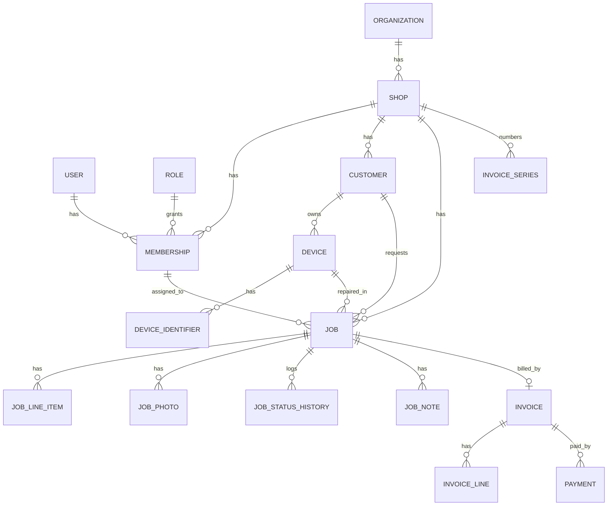

# Database Schema (PostgreSQL / Django)

*Document 2 of 3 · Version 1.0 · 2 October 2026*

This is the target data model for all phases. Build only the tables tagged for the current phase; later tables are listed so early decisions do not block them. Update this file in the same change as any model change.

**Phase tags:** `P0` foundations · `P1` core repair MVP · `P2` stock/POS/khata/staff · `P3` scale and monetisation · `P4` marketplace

---

## 1. Conventions

| Topic | Rule |
|---|---|
| Primary keys | `uuid` (Django `UUIDField`, `uuid4`; UUIDv7 optional later for index locality) |
| Tenant key | Business tables carry `shop_id`. Queries are always scoped (see `.agents/rules/01-tenancy-and-data.md`) |
| Standard columns | `id`, `shop_id`, `created_at`, `updated_at`, `deleted_at` (soft delete), `created_by_id`, `version` (int, optimistic concurrency) |
| Money | `bigint`, integer paise, column names end in `_paise` |
| Quantities | `numeric(10,3)` where fractions are possible, else `integer` |
| Time | `timestamptz` in UTC; dates without time as `date` |
| Enums | Stored as `varchar` with Django `TextChoices` + `CHECK` constraint (easier to migrate than DB enums) |
| Phones | E.164 string, max 16 chars |
| Files | Store object keys (path in storage), never public URLs; serve via signed URLs |
| Append-only tables | `audit_log`, `job_status_history`, `stock_movement`, `customer_ledger_entry`: no update/delete code paths |
| Text search | `pg_trgm` extension for customer name/phone, IMEI and job lookups |
| Extensions | `pg_trgm` (P1), `postgis` (P4; keep available) |
| Snapshots | Issued documents copy shop/customer/rate data into JSON so history never changes |

---

## 2. Core relationships

---

## 3. Django apps and table ownership

| App | Tables | Phase |
|---|---|---|
| `core` | abstract base models, scoping manager, audit mixin | P0 |
| `accounts` | `user`, `otp_challenge`, `user_device`, `account_deletion_request` | P0 |
| `tenancy` | `organization`, `shop`, `role`, `membership`, `invite`, `shop_brand`, `accessory_option` | P0/P1 |
| `audit` | `audit_log` | P0 |
| `customers` | `customer` | P1 |
| `devices` | `device`, `device_identifier` | P1 |
| `jobs` | `job`, `job_counter`, `job_accessory`, `job_photo`, `job_status_history`, `job_note`, `job_line_item` | P1 |
| `billing` | `invoice_series`, `invoice`, `invoice_line`, `payment` | P1 |
| `messaging` | `message_template`, `message_log` | P1 |
| `inventory` | `item_category`, `supplier`, `item`, `item_compatibility`, `stock_movement`, `price_history`, `demand` | P2 |
| `pos` | `sale`, `sale_line`, `sale_return` | P2 |
| `khata` | `expense_category`, `expense`, `recurring_expense`, `customer_ledger_entry`, `cash_register_session`, `daily_shop_summary` | P2 |
| `staff` | `payroll_entry` (plus salary/commission on `membership`) | P2 |
| `oldbuy` | `old_purchase` | P2 |
| `plans` | `plan`, `subscription`, `subscription_event`, `usage_counter`, `message_credit_ledger` | P3 |
| `engagement` | `campaign`, `customer_feedback`, `site_lead`, `shop_website`, `referral` | P3 |
| `marketplace` | `shop_public_profile`, `market_listing`, `market_report` | P4 |

---

## 4. Tables

`std` = standard shop-scoped columns from section 1.

### 4.1 accounts (global, not shop-scoped) P0

**user**
| Column | Type | Notes |
|---|---|---|
| id | uuid pk | |
| phone | varchar(16) unique | E.164, identity of the account |
| name | varchar(120) | |
| email | varchar(254) null | optional |
| preferred_locale | varchar(8) | `en`, `hi`, `hi-Latn` |
| is_active | bool | |
| is_platform_admin | bool | you / support only |
| last_login_at | timestamptz null | |
| created_at, deleted_at | timestamptz | on deletion: anonymise, keep financial references |

**otp_challenge**: `id`, `phone`, `code_hash`, `purpose` (`login`/`phone_change`), `expires_at`, `attempts`, `max_attempts`, `consumed_at`, `ip` inet, `device_id`, `created_at`. Index `(phone, created_at desc)`. Purge after 7 days.

**user_device**: `id`, `user_id`, `device_id` (client generated), `platform` (`android`/`ios`/`web`), `app_version`, `push_token` null, `last_seen_at`, `revoked_at` null, `refresh_family` uuid. Unique `(user_id, device_id)`.

**account_deletion_request**: `id`, `user_id`, `requested_at`, `scheduled_for`, `status` (`pending`/`cancelled`/`completed`), `completed_at`, `reason`.

### 4.2 tenancy P0/P1

**organization**: `id`, `name`, `owner_user_id`, `status` (`active`/`suspended`/`closed`), `created_at`.

**shop** (the tenant itself)
| Column | Type | Notes |
|---|---|---|
| id | uuid pk | |
| organization_id | uuid fk | |
| name | varchar(150) | |
| shop_type | varchar(20) | `mobile`, `computer`, `tv_appliance`, `other` |
| phone | varchar(16) | |
| address_line1/2, city, pincode | text | |
| state_code | char(2) | GST state code, drives CGST/SGST vs IGST |
| latitude, longitude | numeric(9,6) null | for marketplace later |
| logo_key | text null | |
| timezone | varchar(40) | default `Asia/Kolkata` |
| default_locale | varchar(8) | |
| gst_enabled | bool | per-shop toggle |
| gstin | varchar(15) null | required when `gst_enabled` |
| registration_type | varchar(20) | `regular`, `composition`, `unregistered` |
| upi_id | varchar(100) null | used for UPI QR |
| invoice_prefix | varchar(8) | |
| round_off_enabled | bool | |
| lock_order_after_delivery | bool | |
| engineers_see_assigned_only | bool | default false |
| mask_phone_for_engineers | bool | default false |
| default_warranty_days | int | |
| tracking_enabled | bool | default true |
| tracking_expiry_days | int | days after delivery |
| created_at, updated_at, deleted_at | timestamptz | |

**role**: `id`, `organization_id` null (null = system role), `name`, `is_system`, `permissions` text[] (permission codes from section 8). Unique `(organization_id, name)`.

**membership**: `id`, `user_id`, `shop_id`, `role_id`, `status` (`invited`/`active`/`suspended`/`removed`), `display_name`, `pin_hash` null, `pin_attempts`, `pin_locked_until`, `joined_at`; P2 adds `salary_paise` null, `commission_bp` null. Unique `(user_id, shop_id)` where status ≠ `removed`.

**invite**: `id`, `shop_id`, `phone`, `role_id`, `token_hash`, `expires_at`, `accepted_at`, `invited_by_id`.

**shop_brand** (P1): std + `device_category` (`mobile`, `laptop`, `tv`, `appliance`, `other`), `name`, `is_active`, `sort_order`. Unique `(shop_id, device_category, lower(name))`. Seeded with popular brands on shop creation.

**accessory_option** (P1): std + `name`, `is_default`, `sort_order`.

### 4.3 audit P0

**audit_log** (append-only): `id`, `shop_id` null, `actor_user_id` null, `action` varchar(64), `entity_type`, `entity_id`, `before` jsonb, `after` jsonb, `ip`, `user_agent`, `request_id`, `created_at`. Indexes `(shop_id, created_at desc)`, `(entity_type, entity_id)`.

### 4.4 customers P1

**customer**: std + `name`, `phone` (E.164, null allowed for rough entries), `alt_phone`, `email`, `address`, `notes`, `preferred_locale`, `whatsapp_opt_in`, `sms_opt_in`, `last_job_at` (denormalised).
Unique `(shop_id, phone)` where `deleted_at is null and phone is not null`. Trigram indexes on `name` and `phone`.

### 4.5 devices P1

**device**: std + `customer_id`, `category`, `brand_id` null, `brand_text`, `model`, `color`, `notes`.

**device_identifier**: std + `device_id`, `type` (`imei1`/`imei2`/`serial`/`meid`), `value` varchar(32), `luhn_valid` bool null, `captured_via` (`manual`/`barcode`/`ocr`). Unique `(device_id, type)`. Index `(shop_id, value)` plus a suffix index for "last 4 to 6 digits" lookups.

### 4.6 jobs P1

**job_counter**: `shop_id` pk, `last_job_no` int. Allocated with `select_for_update`.

**job**
| Column | Type | Notes |
|---|---|---|
| std | | |
| job_no | int | per-shop, unique `(shop_id, job_no)` |
| kind | varchar(10) | `full` or `rough` (Rough Reg = minimal job) |
| customer_id, device_id | uuid fk | |
| assigned_to_id | uuid fk membership null | engineer |
| status | varchar(24) | see transitions in section 7 |
| priority | varchar(10) | `low`, `normal`, `urgent` |
| source | varchar(12) | `walk_in`, `site_lead`, `phone` |
| fault_description | text | |
| device_condition | text | scratches, dents, water damage etc. |
| lock_type | varchar(10) | `none`, `pin`, `pattern`, `password` |
| lock_value_enc | bytea null | field-level encrypted; needs `jobs.view_device_lock` |
| estimate_paise | bigint | |
| expected_date | date null | |
| received_at | timestamptz | |
| ready_at, delivered_at | timestamptz null | |
| delivered_by_id | uuid fk null | |
| warranty_days | int | |
| warranty_until | date null | set on delivery |
| tracking_token | varchar(64) unique | random, at least 128 bits |
| is_locked | bool | true after delivery if shop setting on |
| cancel_reason | text null | |
| total_paise, cost_paise | bigint | cached from line items |
Indexes: `(shop_id, status, updated_at desc)`, `(shop_id, assigned_to_id, status)`, `(shop_id, customer_id)`, `(shop_id, created_at desc)`.

**job_accessory**: `id`, `job_id`, `shop_id`, `name`.
**job_photo**: std + `job_id`, `file_key`, `kind` (`before`/`after`/`damage`/`other`), `caption`, `size_bytes`, `taken_by_id`.
**job_status_history** (append-only): std-lite + `job_id`, `from_status`, `to_status`, `changed_by_id`, `changed_at`, `note`.
**job_note**: std + `job_id`, `author_id`, `body`, `visibility` (`internal`/`customer`).
**job_line_item**: std + `job_id`, `kind` (`part`/`labour`/`other`), `description`, `item_id` null (P2 link to inventory), `quantity` numeric(10,3), `unit_cost_paise`, `unit_price_paise`, `discount_paise`, `tax_rate_bp`, `hsn_sac` varchar(8) null.

### 4.7 billing P1

**invoice_series**: `id`, `shop_id`, `kind` (`invoice`/`credit_note`/`bill_of_supply`), `fy_start_year` int, `prefix`, `last_number` int. Unique `(shop_id, kind, fy_start_year)`.

**invoice**
| Column | Type | Notes |
|---|---|---|
| std | | |
| job_id | uuid fk null | null for Quick Bill / POS |
| sale_id | uuid fk null | P2 |
| customer_id | uuid fk null | |
| kind | varchar(16) | `simple_bill`, `tax_invoice`, `bill_of_supply`, `credit_note` |
| status | varchar(10) | `draft`, `issued`, `cancelled` |
| series_id | uuid fk null | set on issue |
| number | int null | set on issue; unique `(shop_id, series_id, number)` |
| number_display | varchar(32) null | e.g. `INV/2026-27/000123` TODO(verify format limits) |
| issue_date | date null | |
| original_invoice_id | uuid fk null | for credit notes |
| place_of_supply_state | char(2) null | |
| customer_gstin | varchar(15) null | |
| subtotal_paise, discount_paise, taxable_paise | bigint | |
| cgst_paise, sgst_paise, igst_paise | bigint | |
| round_off_paise, total_paise | bigint | |
| amount_paid_paise | bigint | cached from payments |
| shop_snapshot, customer_snapshot | jsonb | frozen on issue |
| pdf_key | text null | |
| notes, terms | text | |
| issued_by_id, issued_at | | |
| cancelled_at, cancel_reason | | cancellation = credit note, never delete |

**invoice_line**: std + `invoice_id`, `position`, `description`, `hsn_sac`, `quantity`, `unit_price_paise`, `discount_paise`, `tax_inclusive` bool, `tax_rate_bp`, `taxable_paise`, `cgst_paise`, `sgst_paise`, `igst_paise`, `line_total_paise`.

**payment**: std + `invoice_id` null, `job_id` null (advances), `customer_id` null, `direction` (`in`/`out`), `mode` (`cash`/`upi`/`card`/`bank`/`credit`), `amount_paise` (`CHECK > 0`), `reference`, `received_by_id`, `received_at`, `register_session_id` null (P2), `refunds_payment_id` null, `idempotency_key` uuid, `notes`. Unique `(shop_id, idempotency_key)`.

### 4.8 messaging P1

**message_template**: `id`, `shop_id` null (null = platform default), `key` (`job_received`, `status_update`, `ready_for_pickup`, `invoice`, `otp`), `channel` (`sms`/`whatsapp`), `locale`, `body`, `dlt_template_id` null, `wa_template_name` null, `is_active`.
**message_log**: std + `channel`, `to_phone_masked`, `template_key`, `locale`, `job_id` null, `status` (`queued`/`sent`/`delivered`/`failed`), `provider_message_id`, `error_code`, `cost_paise` null, `sent_at`.

### 4.9 inventory P2

- **item_category**: std + `name`, `parent_id` null
- **supplier**: std + `name`, `phone`, `address`, `gstin` null, `notes`, `payable_paise` (cached)
- **item**: std + `category_id`, `sku`, `name`, `brand`, `barcode`, `hsn_sac`, `unit`, `cost_paise` (latest), `price_paise`, `tax_rate_bp`, `reorder_level`, `is_service`, `is_active`, `qty_on_hand` (cached from movements)
- **item_compatibility** (H/W Match): `item_id`, `device_brand`, `device_model`, `notes`
- **stock_movement** (append-only): std-lite + `item_id`, `kind` (`in`/`out`/`adjust`/`return_in`/`return_out`/`repair_use`/`sale`), `quantity` (signed), `unit_cost_paise`, `supplier_id` null, `ref_type` (`job`/`sale`/`purchase`/`adjustment`), `ref_id`, `note`, `moved_by_id`, `moved_at`
- **price_history**: `item_id`, `supplier_id`, `cost_paise`, `recorded_at` (drives price-drop alerts)
- **demand**: std + `item_text`, `customer_id` null, `quantity`, `status` (`open`/`fulfilled`/`dropped`), `note`

### 4.10 POS P2

- **sale**: std + `sale_no` (per-shop counter), `customer_id` null, `status` (`draft`/`completed`/`returned`), totals (paise), `invoice_id` null, `sold_by_id`, `sold_at`
- **sale_line**: std + `sale_id`, `item_id` null, `description`, `quantity`, `unit_cost_paise`, `unit_price_paise`, `discount_paise`, `tax_rate_bp`
- **sale_return**: std + `sale_id`, `reason`, `refund_paise`, `returned_at`, `credit_note_id` null

### 4.11 khata P2

- **expense_category**: std + `name`
- **expense**: std + `category_id`, `amount_paise`, `expense_date`, `paid_via` (payment mode), `supplier_id` null, `note`, `recurring_id` null
- **recurring_expense**: std + `name`, `amount_paise`, `day_of_month`, `category_id`, `is_active`, `last_generated_for` (month)
- **customer_ledger_entry** (append-only): std-lite + `customer_id`, `kind` (`charge`/`payment`/`adjustment`), `amount_paise` (signed), `ref_type`, `ref_id`, `reason`
- **cash_register_session**: std + `opened_by_id`, `opened_at`, `opening_cash_paise`, `closed_by_id`, `closed_at`, `expected_cash_paise`, `expected_upi_paise`, `expected_card_paise`, `counted_cash_paise`, `difference_paise`, `notes`
- **daily_shop_summary** (rebuildable cache): `shop_id`, `date`, `revenue_paise`, `cost_paise`, `expense_paise`, `profit_paise`, `jobs_received`, `jobs_delivered`, `sales_count`, plus splits for repairs/sales/rough/quick. Unique `(shop_id, date)`.

### 4.12 staff and old-buy P2

- **payroll_entry**: std + `membership_id`, `period` (first day of month), `base_paise`, `commission_paise`, `advance_deduction_paise`, `other_deduction_paise`, `net_paise`, `status` (`draft`/`paid`), `paid_at`, `paid_mode`, `note`
- **old_purchase** (Old Buy): std + `seller_name`, `seller_phone`, `device_brand`, `device_model`, `imei`, `price_paise`, `condition`, `id_proof_key` null, `purchased_at`, `resale_status`. TODO(verify) legal record-keeping requirements for second-hand device purchases.

### 4.13 plans and engagement P3

- **plan**: `id`, `code`, `name`, `interval` (`monthly`/`quarterly`/`yearly`/`lifetime`), `price_paise`, `limits` jsonb (`max_active_jobs`, `max_staff`, `max_shops`, `sms_credits`), `features` text[], `is_active`
- **subscription**: `organization_id`, `plan_id`, `status` (`trialing`/`active`/`past_due`/`cancelled`/`expired`), `source` (`play`/`apple`/`razorpay`/`manual`/`partner`), `external_ref`, `current_period_start`, `current_period_end`, `cancel_at_period_end`
- **subscription_event**: `subscription_id`, `type`, `payload` jsonb, `external_event_id` unique (idempotent webhooks), `received_at`
- **usage_counter**: `organization_id`, `metric`, `period`, `value`
- **message_credit_ledger**: `organization_id`, `delta`, `reason`, `ref`, `created_at`
- **campaign**: std + `name`, `template_id`, `filter` jsonb, `status`, `scheduled_at`, `stats` jsonb
- **customer_feedback**: std + `job_id`, `rating` (1 to 5), `comment`, `media_key` null, `submitted_at`, `is_public`
- **site_lead**: std + `name`, `phone`, `device_brand`, `device_model`, `condition`, `expected_price_paise`, `status` (`new`/`contacted`/`bought`/`rejected`), `source_url`
- **shop_website**: `shop_id` unique, `slug` unique, `theme`, `about`, `services` jsonb, `published`, `custom_domain` null
- **referral**: `referrer_org_id`, `referee_org_id`, `code`, `status`, `reward_days`

### 4.14 marketplace P4

- **shop_public_profile**: `shop_id` unique, `slug`, `tagline`, `categories` text[], `location` geography(Point) (PostGIS), `verified_at`, `verified_by_id`, `is_trusted`, `is_published`, `rating_cache`
- **market_listing**: std + `item_id` null, `title`, `description`, `price_paise`, `condition`, `category`, `brand`, `images` jsonb, `is_active`, `expires_at`
- **market_report**: `reporter_user_id`, `target_type`, `target_id`, `reason`, `status`, `resolved_by_id`

---

## 5. Counters and numbering

| Number | Scope | Rule |
|---|---|---|
| `job_no` | per shop | `select_for_update` on `job_counter`, increment inside the same transaction as the job insert |
| Invoice number | per shop + kind + financial year | `select_for_update` on `invoice_series`; assigned only on issue; never reused; consecutive |
| `sale_no` | per shop | same pattern as `job_no` |
| Financial year | April to March | `fy_start_year = year if month >= 4 else year - 1` |

---

## 6. Constraints and integrity checklist

- Foreign keys use `PROTECT` for business data; deletion is soft.
- `CHECK (amount_paise > 0)` on payments; `CHECK (quantity <> 0)` on stock movements.
- Invoice totals: `total = taxable + cgst + sgst + igst + round_off` verified in the service layer and by a DB check where practical.
- Unique constraints on soft-deleted tables use partial indexes (`WHERE deleted_at IS NULL`).
- Cross-shop references are rejected: every FK between two shop-scoped tables must share `shop_id` (validate in serializers and add a model-level `clean()`; consider composite FKs later).
- Issued invoices: block `UPDATE`/`DELETE` in the service layer; optionally enforce with a DB trigger.
- Append-only tables: no update/delete paths; optionally add triggers.
- Search: trigram GIN indexes on `customer.name`, `customer.phone`, `device_identifier.value`.

---

## 7. Job status machine

| From | Allowed next |
|---|---|
| `received` | `diagnosing`, `awaiting_approval`, `in_repair`, `cancelled` |
| `diagnosing` | `awaiting_approval`, `awaiting_parts`, `in_repair`, `returned_unrepaired`, `cancelled` |
| `awaiting_approval` | `in_repair`, `awaiting_parts`, `returned_unrepaired`, `cancelled` |
| `awaiting_parts` | `in_repair`, `cancelled` |
| `in_repair` | `repaired`, `awaiting_parts`, `returned_unrepaired` |
| `repaired` | `ready_for_pickup`, `in_repair` (rework) |
| `ready_for_pickup` | `delivered`, `in_repair` (rework) |
| `delivered` | terminal if `lock_order_after_delivery`; otherwise reopen needs `jobs.reopen` |
| `cancelled`, `returned_unrepaired` | terminal; reopen needs `jobs.reopen` |

Every transition writes `job_status_history`, audit, and (if configured) queues a customer message. Setting `delivered` sets `delivered_at`, `delivered_by_id`, `warranty_until`, and `is_locked`.

---

## 8. Permissions and default roles

Permission codes (stored in `role.permissions`):

| Group | Codes |
|---|---|
| Jobs | `jobs.view`, `jobs.view_all`, `jobs.create`, `jobs.edit`, `jobs.change_status`, `jobs.assign`, `jobs.deliver`, `jobs.reopen`, `jobs.delete`, `jobs.restore`, `jobs.delete_permanent`, `jobs.view_device_lock` |
| Customers | `customers.view`, `customers.create`, `customers.edit`, `customers.see_phone`, `customers.delete` |
| Invoices | `invoices.view`, `invoices.create_draft`, `invoices.issue`, `invoices.cancel`, `invoices.print` |
| Payments | `payments.view`, `payments.record`, `payments.refund` |
| Money views | `money.see_cost_profit`, `reports.view_basic`, `reports.view_profit` |
| Data | `data.export`, `data.bulk_delete` |
| Admin | `staff.view`, `staff.manage`, `roles.manage`, `shop.settings`, `printers.configure`, `billing.subscription` |
| P2 | `inventory.view`, `inventory.edit`, `stock.adjust`, `pos.sell`, `pos.refund`, `register.close`, `expenses.manage`, `payroll.manage` |
| P3 | `messages.send_bulk`, `campaigns.manage`, `website.manage` |

Default role matrix (owners can create custom roles):

| Capability | Owner | Manager | Front desk | Engineer |
|---|---|---|---|---|
| See all jobs | ✓ | ✓ | ✓ | per shop toggle |
| Create/edit jobs | ✓ | ✓ | ✓ | edit assigned only |
| Change status | ✓ | ✓ | ✓ | ✓ |
| Deliver | ✓ | ✓ | ✓ | per shop toggle ("staff delivery access") |
| See device lock | ✓ | ✓ | ✓ | ✓ (assigned jobs) |
| See customer phone | ✓ | ✓ | ✓ | per shop mask setting |
| See cost/profit | ✓ | ✓ | ✗ | ✗ |
| Issue invoices, record payments | ✓ | ✓ | ✓ | ✗ |
| Refund, cancel invoice | ✓ | ✓ | ✗ | ✗ |
| Delete / restore | ✓ | ✓ | ✗ | ✗ |
| Permanent delete, export, bulk delete | ✓ | ✗ | ✗ | ✗ |
| Staff, roles, shop settings | ✓ | staff only | ✗ | ✗ |
| Subscription / billing | ✓ | ✗ | ✗ | ✗ |

---

## 9. Retention, deletion and privacy

- **Soft delete** keeps rows 30 days in trash (configurable), then a scheduled job may purge non-financial rows. Financial rows (invoices, payments, ledger) are retained according to the shop's legal obligations. TODO(verify) retention periods with a CA.
- **Account deletion:** anonymise the `user` row after the grace period; keep `membership`, invoices and audit rows with the anonymised reference.
- **Customer deletion requests:** anonymise `customer` (name, phone, address) but keep amounts on invoices through the invoice snapshot rules agreed with the shop.
- **OTP data** purged after 7 days; **message logs** keep masked phones only.
- **Photos** can be set to auto-expire after delivery plus N days.

---

## 10. Migration order

1. `core`, `accounts`, `tenancy`, `audit` (P0)
2. `customers`, `devices`, `jobs` (P1)
3. `billing`, `messaging` (P1)
4. Seed data: system roles, default message templates, default brands/accessories per shop type
5. P2 apps in this order: `inventory`, `pos`, `khata`, `staff`, `oldbuy`; then link `job_line_item.item_id` and `payment.register_session_id`
6. P3 and P4 apps when their phase opens

Never edit an applied migration. Large backfills run as separate data migrations or management commands.
